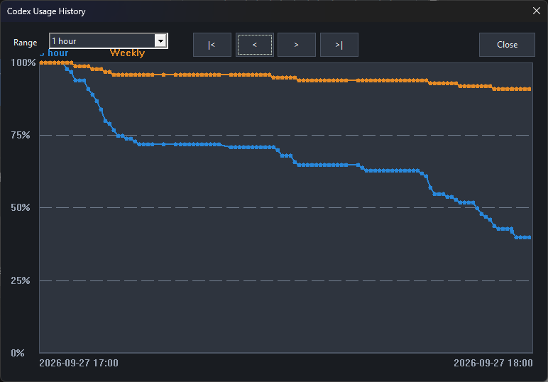

# CodexUsage

Windows용 MFC Codex 사용량 위젯입니다. 로그인된 Codex CLI의 ChatGPT 사용량을 주기적으로 읽어 남은 비율, 리셋 시각, 리셋 크레딧을 표시합니다. 창 크기는 360 × 280픽셀이며 제목 표시줄 없이 드래그해 이동할 수 있습니다.

## 기능

- 단기·장기 한도와 남은 비율, 리셋 시각 표시. 값이 없으면 N/A, 연결이 끊기면 마지막 값을 회색으로 표시
- Windows 밝음/어두움 테마 연동, 투명도, 항상 위, 조회 주기 설정
- Warning·Alert 기준에 따라 막대 색상 변경 및 Windows 알림 요청. 기본값은 남은 비율 50%와 20%
- Codex CLI 실행, 설치된 Codex GUI 실행 또는 숨겨진 창 복원
- 트레이 아이콘의 사용량 도움말, 클릭 복원, 새로 고침·종료 메뉴
- 현재 사용자 로그인 시 자동 실행 및 시작 시 트레이로 숨기기
- 일별 CSV 기록, 1시간·1일·30일 그래프, 기준선 및 측정 지점 도움말

## 준비사항

- Windows 10/11, Visual Studio 2022의 C++ 데스크톱 개발 도구·MFC·Windows SDK
- ChatGPT 계정으로 로그인한 Codex CLI (`codex.exe`)
- 프로젝트 설정의 `$(ZEUSKIM_INC)` 및 `$(ZEUSKIM_LIB_VS2022_X64)` 경로를 사용하는 개발 환경. 이 프로젝트는 해당 경로의 라이브러리를 직접 사용하지 않습니다.

## 설치 프로그램

GitHub Releases의 `CodexUsage-Setup-1.0.2026.0926-x64.exe`를 받아 실행합니다. Windows 10/11 x64의 현재 사용자 폴더에 설치되므로 앱 자체에는 관리자 권한이 필요하지 않습니다. Visual C++ 런타임이 없거나 오래된 경우, 설치 파일에 포함된 Microsoft 공식 재배포 패키지가 설치되며 이 단계에서 Windows가 관리자 권한을 요청할 수 있습니다. 시작 메뉴 바로 가기가 만들어지고 바탕 화면 아이콘은 선택 사항입니다. Windows 앱 목록에서 제거할 수 있으며, 자동 시작 항목은 이 설치 경로를 가리킬 때만 삭제합니다. 개인 설정은 제거 후에도 보존됩니다.

설치 파일을 직접 만들려면 Visual Studio 2022의 C++/MFC 구성 요소와 Inno Setup 6을 설치한 뒤 PowerShell에서 `./tools/BuildInstaller.ps1`을 실행합니다. 스크립트는 Release x64를 별도 폴더에 빌드하고 Visual Studio에 포함된 `vc_redist.x64.exe`를 묶어 `dist/`에 설치 파일을 만듭니다. 실행 중인 위젯의 EXE는 덮어쓰지 않습니다.

## 빌드 및 사용

`CodexUsage.sln`을 Visual Studio 2022에서 열어 `Release | x64`로 빌드합니다. 실행 파일은 `x64/Release/CodexUsage.exe`입니다.

실행 후 **Settings**에서 투명도(20~100%), 조회 주기(10~3600초), 남은 비율 Warning/Alert 기준(`0 ≤ Alert < Warning ≤ 100`), 자동 실행, 트레이 시작 여부를 설정합니다. 실행 파일 자동 검색이 실패하면 CLI 또는 GUI 경로를 지정할 수 있습니다. 설정은 현재 사용자 레지스트리의 `Citopia` 키에 저장됩니다. 자동 실행은 현재 사용자의 Windows `Run` 키에 실행 파일 경로를 등록합니다. 실행 파일을 이동했다면 새 위치에서 자동 실행 설정을 다시 저장하세요.

**Codex CLI**는 새 콘솔에서 CLI를 열고 **Codex GUI**는 실행 중인 창을 표시하거나 설치된 앱을 실행합니다. **−** 버튼이나 시스템 최소화는 트레이로 숨깁니다. 트레이 아이콘 클릭은 창 복원, 오른쪽 클릭은 표시·새로 고침·종료 메뉴를 엽니다. 트레이 등록에 실패하면 창을 유지합니다.

사용량은 [Codex App Server의 `account/rateLimits/read`](https://learn.chatgpt.com/docs/app-server)로 조회합니다. 서버 응답의 `usedPercent`를 남은 비율로 바꿔 표시합니다. CLI와 GUI가 다른 계정으로 로그인되어 있다면 값이 다를 수 있습니다. 앱은 로그인 토큰을 별도로 저장하지 않습니다. Windows 알림 설정과 방해 금지 모드에 따라 배너 표시 여부가 달라집니다.

## 사용량 기록과 그래프

설정에서 **Save usage data to CSV**를 켜면 5시간·주간 잔여량이 모두 정상 조회될 때마다 실행 파일 폴더에 usageYYYYMMDD.csv를 만듭니다. 열은 date_time,5_hour_remaining,weekly_remaining이며 남은 비율(%)을 기록합니다. **Refresh** 옆 그래프 버튼에서 1시간·1일·30일 꺾은선 그래프를 선택하고 첫/이전/다음/마지막 데이터 구간으로 이동할 수 있습니다. CSV를 사용하지 않을 때는 그래프 버튼이 활성화 안내를 표시합니다. 설치본은 사용자 LocalAppData 폴더에 기록하며, CSV 파일은 개인 사용 기록이므로 Git에서 제외합니다.

그래프의 파란색 선은 5시간 잔여량, 주황색 선은 주간 잔여량입니다. 25·50·75% 기준선을 표시하며, 측정 지점에 마우스를 올리면 날짜·시간과 잔여량을 확인할 수 있습니다. History 창도 Windows 다크·라이트 테마에 맞춰 표시됩니다.

## Windows 알림 센터

Warning(기본 50%) 또는 Alert(기본 20%) 이하로 잔여량이 내려가면 Windows 토스트 알림을 보냅니다. 첫 조회부터 이미 기준 이하인 경우에도 알리며, 같은 상태에서는 중복 알림을 보내지 않습니다. 5시간·주간 한도는 각각 판단하고 사용량 회복도 알립니다.

알림 배너가 사라진 뒤에도 Windows 알림 센터에서 내용을 확인할 수 있도록 앱 식별자와 시작 메뉴 바로 가기를 등록합니다. 알림마다 고유 식별자를 사용하며, 알림을 클릭하면 위젯을 표시하거나 실행합니다. 사용자가 지우거나 Windows가 기록을 정리하기 전까지 확인할 수 있습니다. Windows 알림 설정과 방해 금지 설정은 배너 표시에 영향을 줍니다.

트레이 아이콘을 오른쪽 클릭하고 **알림 테스트**를 선택한 뒤 Windows 11에서는 **Win+N**, Windows 10에서는 **Win+A**로 확인하세요. 실행 파일에 --test-notification 옵션을 전달해도 테스트할 수 있습니다. 현재 소스의 Release x64 빌드, 회귀 테스트 31개 및 실제 알림 기록 보관을 확인했습니다.

이 설명은 현재 소스 기준입니다. 기존 공개 설치 파일은 이번 알림 센터 수정으로 교체되지 않았으므로 최신 기능을 사용하려면 소스를 빌드하세요.

## macOS

macOS 13 이상용 메뉴 막대 앱을 `macOS/`에 별도 구현했습니다. Windows 위젯과 같은 Codex 사용량 조회·경고·설정·CLI/GUI 실행을 지원합니다. CSV 기록과 1시간·1일·30일 사용량 그래프도 현재 소스에 추가했습니다. [이전 macOS 미리보기(그래프 미포함)](https://github.com/kjw0737/CodexUsage/releases/tag/v1.0.2026.0926-mac-preview)와 [빌드 및 사용법](macOS/README.md)을 참조하세요. Apple Silicon·Intel 범용 앱 빌드와 7개 Swift 테스트가 GitHub Actions에서 통과했습니다.

## 테스트

`tests/UsageClientTests.vcxproj`를 `Release | x64`로 빌드한 뒤 `tests/bin/UsageClientTests.exe`를 실행합니다. 사용량 파싱, 경고 상태 전환, 자동 실행 레지스트리 등록·해제 등을 격리된 키에서 검증합니다. `--live` 옵션을 붙이면 현재 로그인된 CLI와 실제 통신도 시도합니다.

## 아이콘

`CodexUsage/res/CodexUsage-source.png`를 바탕으로 `tools/GenerateIcon.ps1`이 프로그램·트레이용 다중 해상도 ICO를 생성합니다. 노란색 ChatGPT 심볼과 사용량 그래프를 사용합니다. ChatGPT 명칭과 심볼은 OpenAI의 상표이며, 이 프로젝트는 OpenAI의 공식 제품이 아닙니다.

## 변경 기록

2026-09-26: 위젯, Codex 사용량 조회, 테마·투명도·설정, 트레이·알림·자동 시작, 아이콘을 구현했습니다. 아이콘 심볼은 `#EFE480`, 가운데 막대는 `#FACC15`입니다. Release x64 빌드와 자동 시작 격리 테스트를 포함한 24개 테스트를 통과했습니다.
2026-09-26 14:21: Inno Setup 6 기반 사용자별 설치·제거 프로그램과 Visual C++ 런타임 포함 빌드 스크립트를 추가했습니다. Release x64 빌드, 설치·제거를 테스트했습니다.
2026-09-26 15:55: macOS 메뉴 막대 위젯, Codex 사용량 조회, 설정·알림·로그인 항목과 앱 번들 빌드 및 Mac CI를 추가했습니다.
2026-09-26 20:50: macOS 배경 드래그 수정, Windows 일별 CSV 사용량 기록과 기간별 그래프·탐색 기능을 추가했습니다.
2026-09-26 21:48: History 창에 Windows 다크/라이트 테마를 적용하고 25·50·75% 점선 기준선을 추가했습니다.
2026-09-26 21:55: History 그래프의 측정 지점에 마우스를 올리면 시각과 5시간·주간 잔여량을 표시하도록 했습니다.
2026-09-26 22:58: macOS 앱에 일별 CSV 사용량 기록, 기간별 그래프·데이터 이동·점 호버 표시와 기존 설정 마이그레이션을 추가했습니다.
2026-09-26 23:40: Mac CI에서 범용 앱 빌드와 Swift 테스트 7개가 통과했습니다.
2026-09-27: Windows에서 첫 조회 시 이미 Warning·Alert 기준 이하인 사용량도 알리고, 트레이 도움말 갱신 후 알림을 보내도록 수정했습니다. Release x64 빌드와 회귀 테스트 31개가 통과했습니다.
2026-09-27: Windows 풍선 알림을 알림 센터에 보관되는 토스트 알림으로 교체했습니다. 앱 식별자·시작 메뉴 바로 가기·프로토콜 활성화를 등록하고 알림 클릭 시 위젯을 복원합니다. 트레이 메뉴의 알림 테스트 또는 --test-notification 옵션으로 확인할 수 있습니다. 실제 Windows 알림 기록에서 고유 ID를 가진 연속 알림과 프로세스 종료 후 보관을 확인했습니다.
